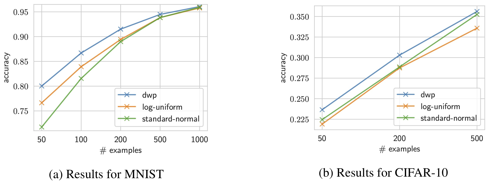
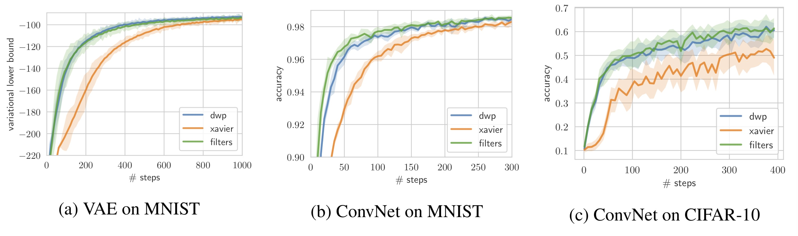
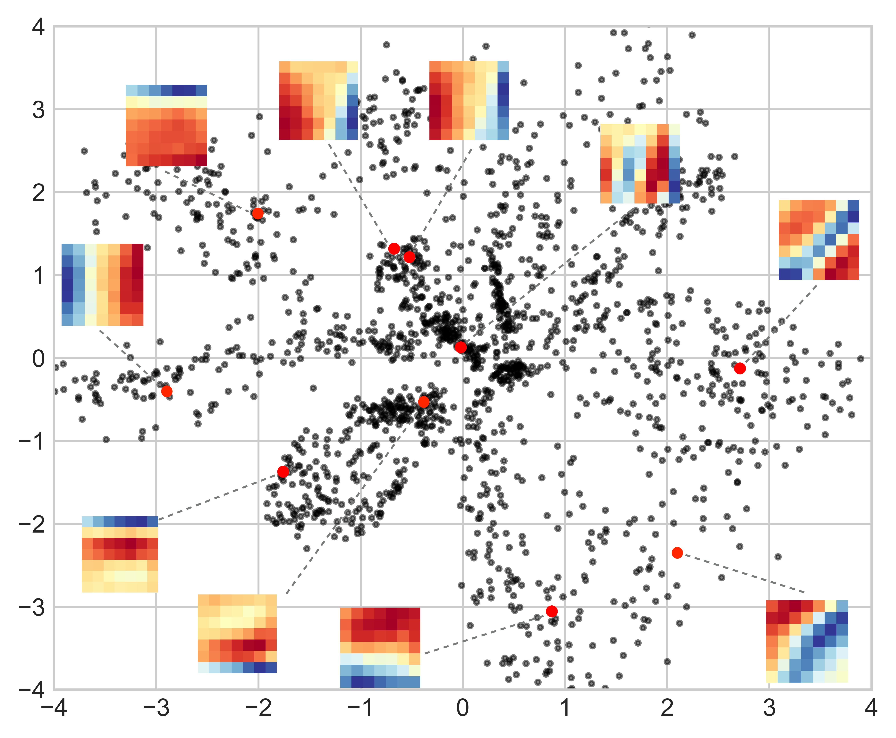

# Deep Weight Prior
This repo contains code for our ICLR2019 paper [The Deep Weight Prior](https://openreview.net/forum?id=ByGuynAct7&noteId=ByGuynAct7).

__The generative model for kernels of convolutional neural networks, that acts as a prior distribution while training on new datasets.__

__Abstract:__ Bayesian inference is known to provide a general framework for incorporating prior knowledge or specific properties into machine learning models via carefully choosing a prior distribution. In this work, we propose a new type of prior distributions for convolutional neural networks, deep weight prior (DWP), that exploit generative models to encourage a specific structure of trained convolutional filters e.g., spatial correlations of weights. We define DWP in the form of an implicit distribution and propose a method for variational inference with such type of implicit priors. In experiments, we show that DWP improves the performance of Bayesian neural networks when training data are limited, and initialization of weights with samples from DWP accelerates training of conventional convolutional neural networks.

## Poster

[](https://senya-ashukha.github.io/projects/dwp_iclr19/dwp-poster-iclr19.pdf)

# Experiments
## Classification

<p align="center">
  
</p>

## Convergence

<p align="center">
  
</p>

## Random Feature Extraction

<p align="center">
  
</p>

# Launch experiments

## Bayesian NN with Deep Weight Prior
Setup environment:
```bash
export DATA_ROOT=<path to MNIST/notMNIST>
export DWP_PATH=<path to logs to save>
```

Train source models (100 times):
```
python train-net.py --data not-mnist --bs 256 --hid_dim 256 512 --l2 0.001 --model fconv --net_cfg vanilla --seed <unique per launch>
```
Then we need to prune kernels with norm almost equal to zero. Selected kenels used for training priors can be found in `data/fconv/conv7x7/` and `data/fconv/conv5x5/`.

<p align="center">
  
</p>
<p align="center">Examples of 7x7 kernels </p>

Train VAE priors:
```
python train-vae.py --hidden_dim 32 --kernel_dim 7 --z_dim 2 --num_epochs 300 --data_dir data/fconv/conv7x7

python train-vae.py --hidden_dim 64 --kernel_dim 5 --z_dim 4 --num_epochs 300 --data_dir data/fconv/conv5x5
```

<p align="center">
  
</p>
<p align="center">VAE latent space for 7x7 kernels</p>

Trained VAEs can found at `data/fconv/vae7x7/` and `data/fconv/vae5x5/`, and can be loaded by `utils.load_vae`.

Train BNN with VAE prior (we vary `data_split_seed` from 0 to 9):

```
python train-bnn.py --data mnist --data_split_seed <seed> --num_examples 50 --epochs 10000 --model fconv --vae_list data/fconv/vae7x7/ data/fconv/vae5x5/ --init_list vae vae --net_cfg bayes --hid_dim 32 128 --prior_list vae vae --eval_freq 100
```

<!-- <p align="center">
  
</p> -->


# Citation

If you found this code useful please cite our paper

```
@article{atanov2019dwp,
  title={The Deep Weight Prior},
  author={Atanov, Andrei and Ashukha, Arsenii and Struminsky, Kirill and Vetrov, Dmitry and Welling, Max},
  journal={arXiv preprint arXiv:1810.06943},
  year={2019}
}
```
